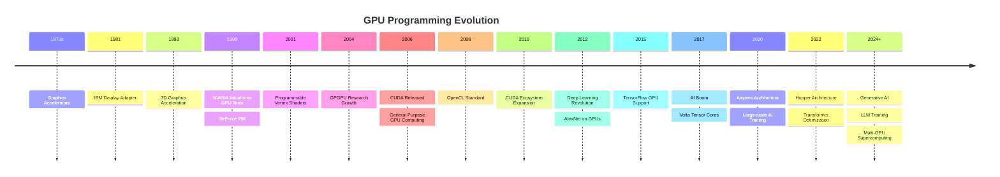
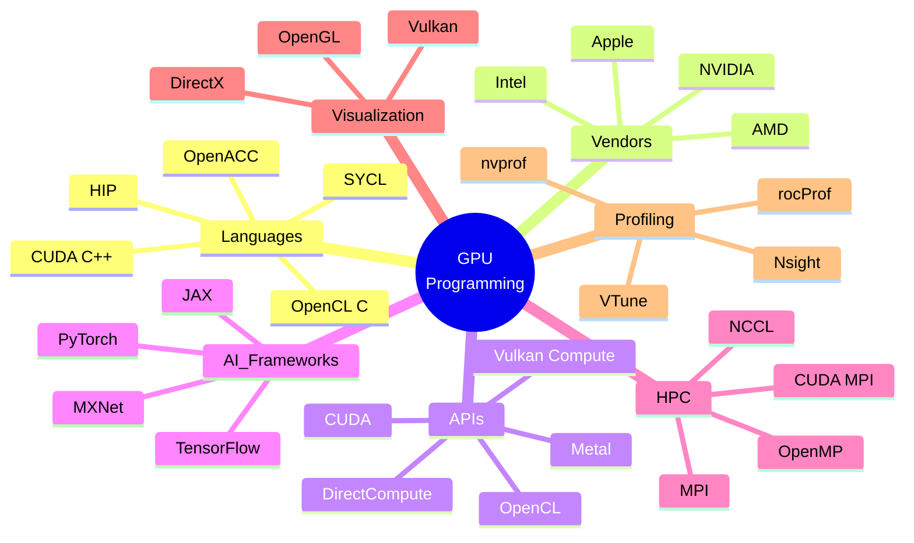
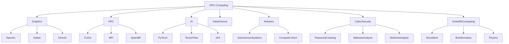
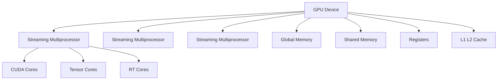
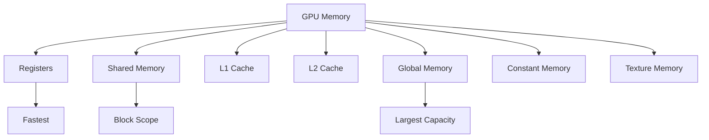
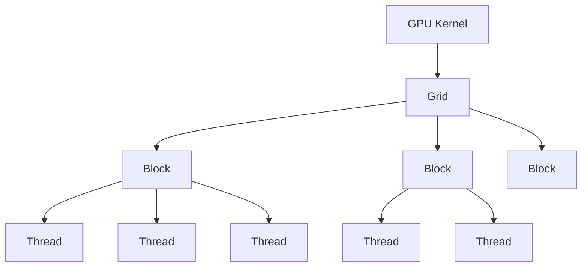
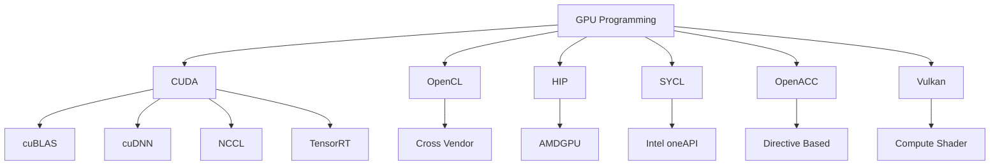

<div align="center">
    <p align="center">
        <a href="https://wikipedia.org/wiki/CUDA">
          
        </a>
    </p>



# **`Awesome`** [GPU](https://wikipedia.org/wiki/Graphics_processing_unit) [Programming](https://developers.redhat.com/articles/2024/08/07/what-gpu-programming) [](https://awesome.re)
</div>

[](https://youtube.com/playlist?list=PL9V4Zu3RroiWMN2G3kXw1IMPQ-fUf-3CQ&si=Xg63QDf04tlsbfRJ)
[](https://www.reddit.com/r/GraphicsProgramming/)

<p align="center">
    <a href="https://github.com/cybersecurity-dev/"></a>
    &nbsp;
    <a href="https://www.youtube.com/@CyberThreatDefense"></a>
    &nbsp;
    <a href="https://cyberthreatdefence.com/my_awesome_lists"></a>
    
</p>



## 📖 Contents
- [Frameworks](#frameworks)
- [Tools](#tools)
- [My Other Awesome Lists](#my-other-awesome-lists)
- [Contributing](#contributing)
- [Contributors](#contributors)


### Frameworks




#### [Pytorch](https://pytorch.org/get-started/locally/)
* Linux
    ```bash
    pip3 install torch torchvision --index-url https://download.pytorch.org/whl/cu132
    ```
* Windows
    ```powershell
    pip3 install torch torchvision --index-url https://download.pytorch.org/whl/cu132
    ```
Test
```shell
python -c "import torch; print(torch.__version__)"
```

### Tools
- [nvitop](https://github.com/XuehaiPan/nvitop) - An interactive NVIDIA-GPU [process viewer](https://nvitop.readthedocs.io/en/latest/) and beyond, the one-stop solution for GPU process management.


### GPU Architecture



### GPU Memory Hierarchy



### GPU Thread Hierarchy



### GPU Programming Frameworks



##
### My Other Awesome Lists
You can access the my other awesome lists [here](https://cyberthreatdefence.com/my_awesome_lists)

### Contributing
[Contributions of any kind welcome, just follow the guidelines](contributing.md)!

### Contributors
[Thanks goes to these contributors](https://github.com/cybersecurity-dev/awesome-gpu-programming/graphs/contributors)!

### License
[](http://creativecommons.org/publicdomain/zero/1.0)

[🔼 Back to top](#awesome-gpu-programming-)
